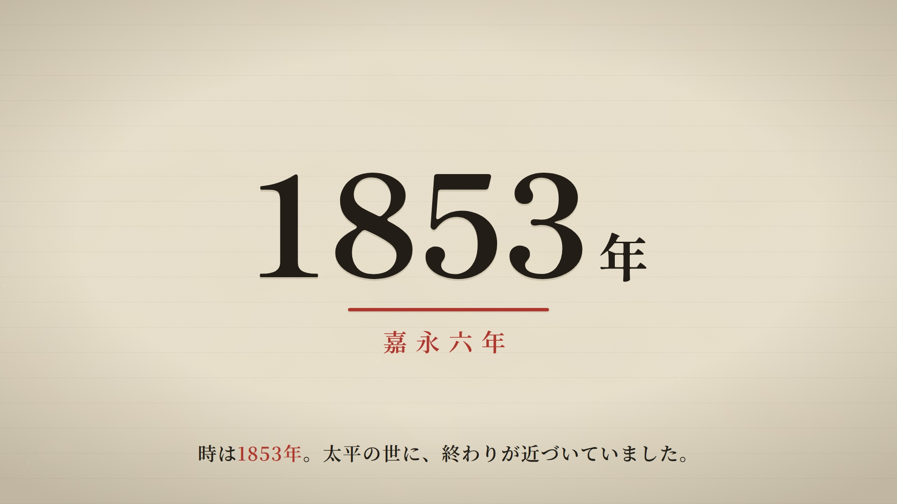
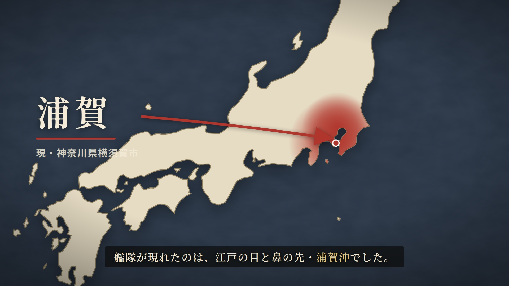
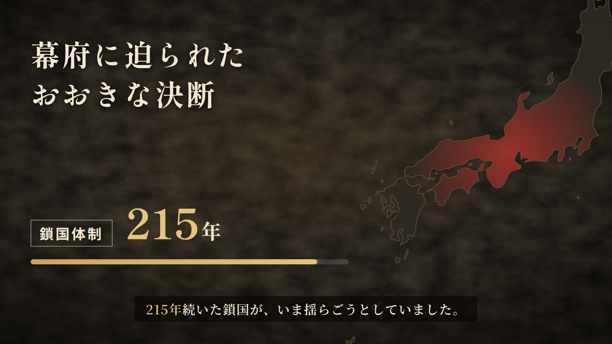

# video-studio

台本(screenplay)データから「1分でわかる日本史」風の
ドキュメンタリー・モーショングラフィックス動画(1920x1080/30fps)を生成する
[Remotion](https://remotion.dev) プロジェクト。

<p>
  
  
  
</p>

## 使い方

```bash
cd video-studio
npm install

# プレビュー(ローカル)
npm run studio

# レンダリング
npx remotion render HistoryVideo out/video.mp4
```

動画の内容は `src/screenplay/` の台本データだけで決まる。
`src/screenplay/demo.ts`(黒船来航)が全シーン型のリファレンス。

```ts
{
  type: 'year',
  year: '1853',
  subLabel: '嘉永六年',
  narration: '時は**1853年**。太平の世に、終わりが近づいていました。',
}
```

## 設計

- **台本駆動**: Claude(または人間)は `Screenplay` 型のデータを書くだけ。
  色・書体・イージング・レイアウトは `src/theme.ts` とシーンコンポーネントが持ち、
  台本側から上書きしない。これが品質担保の仕組み
- **シーン型**: title / year / character / lineup / map / timeline / stat / text / image / outro
  (定義: `src/screenplay/types.ts`)
- **尺の自動決定**: ナレーション文字数から読了時間を計算(約6.5文字/秒)。
  シーン間は12フレームのクロスフェード
- **決定論的レンダリング**: フォントは `public/fonts/` にセルフホスト
  (Shippori Mincho B1 / Noto Serif JP / Noto Sans JP、JIS X 0208サブセット済みWOFF2)。
  日本地図は `src/assets/japanPath.ts`(world-atlas 50mから生成、`scripts/generate-japan-path.mjs`)
- **素材**: 人物立ち絵(背景透過PNG)や情景画は `public/assets/` に置いて
  ファイル名で参照。立ち絵が無い人物は様式化された墨シルエットにフォールバック

制作ワークフローの詳細は `.claude/skills/video-production/SKILL.md` を参照。
